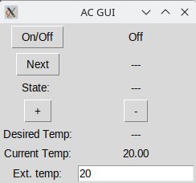
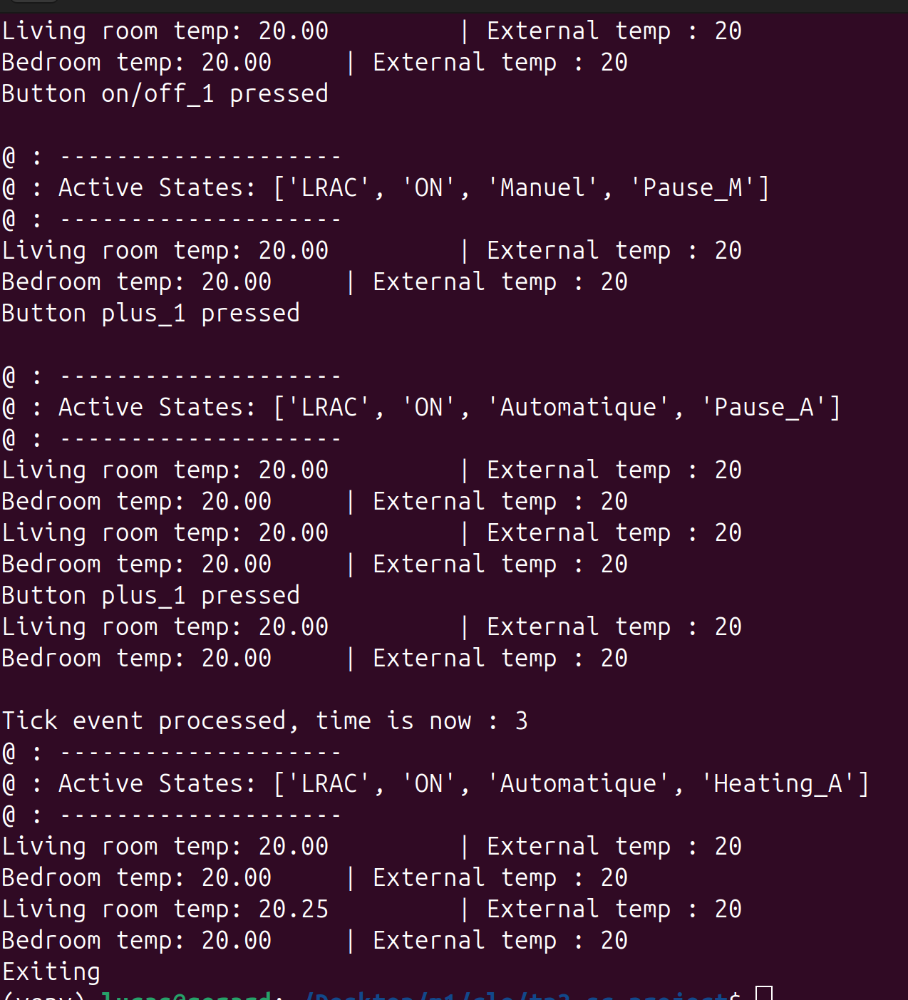

# Instructions

In this project we will use sismic to design and simulate a statechart.

<https://sismic.readthedocs.io/en/latest/>

# Air conditioning

In this project you have to specify, simulate and test the control
system of an air conditioning (AC) system, operating in a house with multiple rooms.
You will have to model two independent AC local units (living room and bedroom) that are coordinated by a central controller unit.
Each local unit regulates the temperature of its own room.
The central controller is responsable for:
- raising an alarm when the temperature is too high, 
- and switching off the local units if the alarm persists for a long period of time.
The central controller can also programmed for a *night mode*, to automatically control the temperature during the night.

## Local Unit Specification

Each AC unit operates in a room of a house with an external
environment. The *current temperature* is the room internal
temperature; the *external temperature* is the temperature of the
external environment (outside the house).


When the AC is turned off, the room temperature naturally evolves with
time so that the current room temperature eventually becomes equal to
the external temperature according to an exponential decay process. 

The user of the AC would like to change this natural behavior so to
achieve a *desired temperature*. The interface consists of four
buttons: an "On/Off" button, a "Next" button, a "Plus" and a "Minus"
buttons.

Each AC unit can be operated in two ways:

- "Manual":
  - Activated at startup
  - The "Next" button cycles between three operating states:
    1. "Pause" (no effect on temperature)
    2. "Cooling" (apply negative power to reduce temperature)
    3. "Heating" (apply positive power to increase temperature)

- "Automatic":
  - Activated whenever the user presses the "Plus" or "Minus" buttons
  - A desired temperature is maintained automatically.
  - The first time that the system enters into the "Automatic" operation mode, the desired temperature is set equal to the *current temperature*. Then,
    - If currTemp < desTemp − 1 → Heating.
    - If currTemp > desTemp + 1 → Cooling.
    - Otherwise → Pause.
  - The desired temperature is updated with each Plus/Minus button press.
  - To switch back to Manual mode, the user presses "Next" again.
  - When switching back to Manual, the last state is remembered: if the system was in "Manual/Heating" mode before switching to "Automatic", it goes back to "Manual/Heating" when pressing the "Next" button; on the other hand, the system remembers the last desired temperature when switching to "Automatic" after the first time.



When on, the display shows the Operating mode ("Cooling", "Pause" or
"Heating", and "Automatic" or "Manual"). If in automatic mode, it also
shows the desired temperature. The display is updated after every change
of state. When off, the display does not show anything.
The user can switch each AC unit on and off by pressing the On/Off button.

## Central Unit Specification

The Central Controller supervises both units, running in parallel with them:

- It monitors safety conditions:

  - If a room temperature exceeds 40°C, it raises an alarm for that room; the alarm can be simulated by simply
printing an appropriate message on the terminal.

  - If the temperature remains above 40°C for more than 5 seconds, the central controller shuts down both units.

- It changes to "night" mode, setting both local units to Automatic mode after 10 pm. 
- It changes back to the previously existing mode at 7 am. 

### Event parameters

In Sismic, events can carry parameters.

See for example the code in this section of the Sismic documentation :
<https://sismic.readthedocs.io/en/latest/concurrent.html#communicating-statecharts>

Look at the example, and observe the line

``` example
- event: button_0_pushed
         action: send('floorSelected', floor= 0)
```

When the event "button_0_pushed" is triggered, the action consist in
triggering a second event "floorSelected" with parameter "floor=0".
Then, in a second state machine called elevator (see here:
<https://github.com/AlexandreDecan/sismic/blob/master/docs/examples/elevator/elevator.yaml>)
the state "floorSelecting" has a transition triggered by the event
"floorSelected", and the corresponding action is :

``` example
- name: floorSelecting
        transitions:
          - target: floorSelecting
            event: floorSelected
            action: destination = event.floor
```

that is: the variable "destination" takes the value "floor" carried by
the event "floorSelected".

## States and events names

In order do uniformise the notation, you need to use the following names for the events of the statechart representing the AC system:
		  
- Events:

          - AC unit 1:
            - next_1    : user presses button "next" on AC1
            - plus_1    : user presses button "plus" on AC1
            - minus_1   : user presses button "minus" on AC1
			- on_off_1  : user presses button "on/off" on AC1
            
          - AC unit 2:
            - next_2    : user presses button "next" on AC2
            - plus_2    : user presses button "plus" on AC2
            - minus_2   : user presses button "minus" on AC2
			- on_off_2  : user presses button "on/off" on AC2
			
		  - CC unit:
			- time_10pm         : it's 10 pm
			- time_8am          : it's 8  am
			- alarm_triggered   : one of the two AC sends this event when it's more than 40 degrees
			- timeout_5sec      : a timeout of 5 seconds has elapsed 
			- tick              : 1 second has elapsed


### Assignment

We recommend that you start incrementally. 

1. Write the YAML statechart for the AC in the Living Room
   (`lr.yaml`)
  * Use the ACGui.py python script to simulate the system. Modify it
    so that the operation mode and the desired temperature for the living 
    room are shown in the interface.
  * Suppose the external temperature is 20 degrees and does not change.
    Find the shortest sequence of events to go from "Off" into
    "Automatic/Heating". Test that your StateChart correctly implements
    it.
  * Write a complete sequence of tests (in Python) to check that the
    AC works as expected. As a minimum you should test the following
    behaviours:
	- All states are reachable with the correct sequence of events;
	- The AC correctly switches to Heating, Pause, Cooling when in
      Automatic mode, depending on the relative values of the current
      and desired temperature;
    - The AC remembers the last desired temperature when it enters
      automatic mode for the second time;
	- The AC remembers the last operating state when it switches to
      "Manual".
  * Check the following properties by using the appropriate contracts:
    - If the AC is in Automatic/Heating mode, then it must be
      true that `currTemp<desTemp-1`
    - If the AC is in Automatic/Cooling mode, then
      `currTemp>desTemp+1`
    - If the AC is in Automatic/Pause mode, then
      `destemp-1<=currTemp<=desTemp+1`

2. Now write a YAML statechart including the behaviour for the AC in
   the Bedroom (`both.yaml`).
   * Test that it works as expected and independently of the AC in the
     Living Room
	 
3. Now write a YAML statechart in which you add the behaviour for the
   Central Unit (`cu.yaml`).
   * Test that the CU raises an alarm if the room temperature of the
      Living room *or* of the Bedroom goes above 40 degrees, and then
      shuts off both ACs after 5 seconds if the temperature is still
      above 40 degrees.

### Answers

States names : 
  - Manual : 
    - Pause_M
    - Cooling_M
    - Heating_M 
  - Automatic :
    - Pause_A
    - Cooling_A 
    - Heating_A

List of yaml files: 
  - [lr.yaml](./lr.yaml) 
  - [both.yaml](./both.yaml)
  - [cu.yaml](./cu.yaml)

#### Question 1
##### Fastest path 
The fastest path to go from Off state to Heating_A is : "On" -> "+" -> "+". 
It needs to press "+" twice because the guard is checking if currTemp is strictly less than desTemp **+1**.

*Proof*: 



#### Instructions 
```
// To run the AC Simulation, please type :

$ python3 ACGui.py <file.yaml>      

// choose between <lr.yaml> <both.yaml> <cu.yaml>
// To run the tests please type : 

$ python3 test.py 

// You will need to manually exit the programm because I didn't found how to end the clock / thread
```