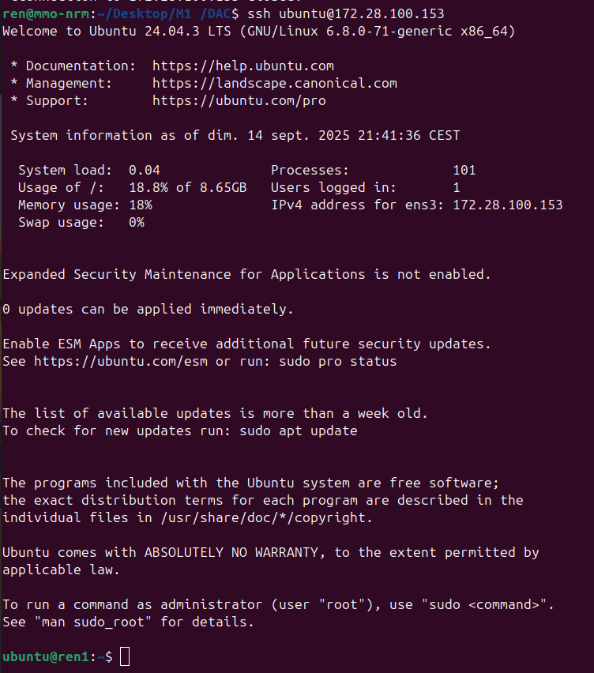

# TP1 -- DAC -- Prise en main d'OpenStack 

Ceci est le compte-rendu de Lucas SAUVAGE du TP1 de DAC pour l'année 2025-2026

## Réponse aux questions 

### Question 1

En premier il faut créer une paire de clé publique-privé qui serviront à sécuriser la connexion via le cryptement RSA. 
Pour ce faire, il faut d'abord générer la paire de clé avec la commande ```ssh-keygen -t rsa -f cloud.key```. 

Ensuite, on importe cette clé sur OpenStack afin de pouvoir instancier une machine qui utilisera cette clé pour les connexions via SSH. 

Pour instancier une machine, il faut se rendre dans la rubrique "Instance", de cliquer sur le bouton "Launch Instance". On doit alors lui donner un nom, choisir une source (qui représente la distribution de la VM), choisir sa "Flavour" (qui représente la puissance de la machine), choisir quelle clé stockée dans OvenCloud sera utilisée pour la connexion SSH. On peut finalement lancer la VM. 

Pour se connecter en SSH depuis la machine locale, il suffit de taper la commande ```ssh {user}@{Adresse IP de la VM}```. Pour le screenshot, l'image utilisée étant celle d'ubuntu et l'adresse IP étant 172.28.100.153, il faudra taper ```ssh ubuntu@172.28.100.153```.


 
Comme on le voit sur la capture, je suis passé de ma machine (ren@mmo-nrm) à la VM (ubuntu@ren1), ren1 étant le nom que j'ai choisi pour le nom de la VM.

### Question 2

Les images disponibles sur OpenStack correspondent aux distributions de Linux disponibles lors de la création des machines virtuelles. 

Pour les installer il suffit de se rendre dans la rubrique "Images" d'OpenStack, de cliquer sur "Create Image" et ensuite de télécharger le fichier afin de pouvoir l'utiliser sur de futurs VMs.

Avoir différentes images permet d'avoir un plus gros contrôle dans le déploiement des instances. En effet, si l'on a juste besoin de VMs très basique, on peut sélectionner une image minimale afin d'optimiser les performances. Cela fonctionne aussi dans l'autre sens, car on peut avoir besoin de machine qui ont un certain nombre de logiciels ou configurations déjà présentes, d'ou l'utilité des images personnalisées.

### Question 3

Supposons que nous disposons d'une liste de 3 VMs avec les configurations suivantes : 

|Nom|@IP|User|
|----|--|----|
|ren1|172.28.100.153|ubuntu
|ren2|172.28.100.138|ubuntu|
|ren3|172.28.101.0|ubuntu|

Le fichier config serait le suivant 

```bash
Host ren1 
    Hostname 172.28.100.153
    User ubuntu 
    IdentityFile ~/.ssh/cloud.key 

Host ren2 
    Hostname 172.28.100.16
    User ubuntu 
    IdentityFile ~/.ssh/cloud.key 

Host ren3 
    Hostname 172.28.100.0
    User ubuntu 
    IdentityFile ~/.ssh/cloud.key 
```

### Question 4

Le fichier envoyé sera le fichier [**to_send.txt**](./to_send.txt) et le protocole utilisé sera le protocole SFTP. En effet, les protocoles SSH et SFTP utilisent le même port, le 22. En utilisant SFTP on évite d'ouvrir un port supplémentaire ce qui me semble plus sécurisé. 

Pour envoyer un fichier, on se connecte en SFTP sur la VM où l'on veut envoyer le fichier. Grâce au fichier config, on peut directement écrire la commande : 
```bash
$ sftp ren1

# Le menu du protocole SFTP s'ouvre alors et l'on peut voir 

Connected to ren1.
sftp> 

# Pour envoyer le fichier on fait alors la commande "put"

sftp> put to_send.txt 
Uploading to_send.txt to /home/ubuntu/to_send.txt
to_send.txt  

# Même si le retour "Uploading to_send.txt etc." prouve que le téléversement a fonctionné, on peut s'en convaincre de cette manière 

sftp> pwd
Remote working directory: /home/ubuntu
sftp> ls
to_send.txt  

``` 

### Question 5

Pour cette question je vais effectuer un ping de la machine ren1 vers la machine ren2. 

La commande qui permet de capturer les trames est la suivante :

```bash
sudo tcpdump -i ens3 host 172.28.100.153 -w ssh_vm1_vm2.pcap
```

Cette commande utilise tcpdump, capture les trames de l'interface ens3 ne venant que de l'adresse 172.28.100.153 et enregistre les logs dans un fichier ssh_vm1_vm2.pcap (ouvrable notamment dans WireShark). 

Lors du [**ping**](./screenshots/Q5_ping.png) de ren1 vers ren2, on voit bien dans la [**capture de trames**](./screenshots/Q5_capture.png) que le paquet est bien arrivé à destination en utilisant le protocole ICMP. 

### Question 6

Pour configurer le pare-feu des machines, je vais utiliser l'outil ```ufw``` qui est un outil fournissant les commandes minimales. 

Pour rédiger ce README j'ai "recommencé" le TP pour avoir des captures d'écrans plus précises. 
J'ai donc utilisé des images d'Ubuntu pour les VMs, alors que j'avais choisi Debian lors du TP. 
Pour installer UFW qui n'est pas disponible de base du Debian j'avais alors réalisé ce [**script**](./scripts/install_ufw.sh) : 

```bash 
for i in {1..4}
do 
    ssh comp$i "sudo apt update && sudo apt install ufw"
done    
``` 

Mes machines s'appelaient alors ```comp{1-4}```. (Elles s'appellent ```ren{1-3}``` dans les screenshots). 

On commence par activer le pare-feu comme ceci : 

```bash 
ubuntu@ren1:~$ sudo ufw enable
Command may disrupt existing ssh connections. Proceed with operation (y|n)? y
Firewall is active and enabled on system startup
ubuntu@ren1:~$ sudo ufw status verbose
Status: active
Logging: on (low)
Default: deny (incoming), allow (outgoing), disabled (routed)
New profiles: skip

```

Lorsque UFW est activé, par défaut le trafic entrant est refusé et le trafic sortant est autorisé. Il nous suffit alors d'autoriser le trafic entrant utilisant le port 22, qui nous permet la connexion SSH et le transfert de fichier via SFTP. 

Pour autoriser les connexions sur le port 22, il suffit d'ajouter une règle grâce à cette commande ```sudo ufw allow 22/tcp```. On autorise seulement la connexion via le protocole TCP. 


Grâce a la commande ```sudo ufw status verbose```, on peut afficher la [**liste des règles**](./screenshots/Q6.png) et voir que seul les données provenant du port 22 et utilisant le protocole TCP sont autorisées à se connecter à la machine. 


### Question 7

Pour cette question, je n'ai pas réussi à avoir une erreur du type `Connexion refused`. En effet, ufw ne refuse pas les connexions, il les dévie. Cependant, il n'autorise que les connexions sur le port 22 avec le protocole TCP. Seulement le protocole ssh peut entrer par ce port et ce protocole utilisant un protocole de cryptement RSA, seul un ordinateur quantique pourrait espérer craquer la clé (a moins d'avoir quelques décennies). Tout ça pour deux fichiers .txt. 
