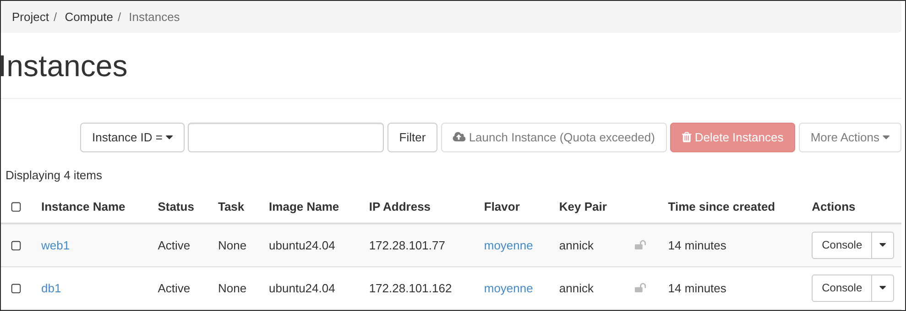

# TP 5 - Provisionnement avec OpenTofu 
Ceci est le dêpot pour le TP5 de DAC de Lucas SAUVAGE pour l'année 2025-2026 

## TP 

Pour ce TP, il était demandé de respecter le cahier des charges suivant : 

    - Les machines doivent avoir des noms identifiant des fonctions potentielles,
    e.g. db1 et web1
    — Le configuration ne doit contenir aucun mot de passe en clair ou l’exécution du script ne doit pas en afficher
    — Les machines doivent être accessible en SSH depuis une clef préalablement enregistrée sur l’interface d’OpenStack
    — La clef SSH doit être reconfigurable sans éditer le script
    — Le script doit exporter les adresses IP des machines respectives
    — Si une machine est supprimée, exécuter le script doit en réallouer une
    — La configuration doit être idempotente

Pour arriver à la configuration demandée, nous allons utiliser OpenTofu, qui permet d'automatiser l'installation. 
En premier, il faut récuperer les informations nécessaires à la connexion à OpenStack, qui le fournit directement sur le site dans un fichier [*clouds.yaml*](./clouds.yaml)
En condition réelle, mettre ce fichier dans le dossier ~/.config/openstack/clouds.yaml. Pour rendre le TP je dois le laisser à la racine, mais OpenTofu ne le trouvera pas. 
Pour pallier à ce problème j'ai mis les informations nécessaires dans le fichier [*terraform.tvars*](./terraform.tfvars). 

Il faut ensuite créer le fichier main qu'OpenTofu utilisera pour la configuration. Il se trouve [**ici**](./main.tf). 

### Création du fichier *main.tf*

#### terraform

La première étape est d'initialiser terraform (avec le log en dessous), qui est un environnement logiciel "infrastructure as code", c'est à dire qui sert à installer et configurer des infrastructures informatiques.

```terraform
terraform {
  required_version = ">= 1.4.0"
  required_providers {
    openstack = {
      source  = "terraform-provider-openstack/openstack"
      version = "~> 1.53.0"
    }
  }
}
```

#### Variables

Il faut ensuite déclarer les variables et leur type. Ces variables sont initialisées dans [*terraform.tvars*](./terraform.tfvars). 

```terraform
variable "os_auth_url" {type = string} 
variable "os_username" {type = string} 
variable "os_project_id" {type = string} 
variable "os_project_name" {type = string} 
variable "os_domain" {type = string} 
variable "os_region" {type = string} 
variable "os_password" {
    type = string
    sensitive = true
}
variable "image_name" {type = string}
variable "image_id" {type=string}

variable "vm_flavor" {type=string}


variable "vm_key_pair" {type=string}

variable "instance_names" {type=list(string)} 
```

#### Provider 

Un provider fournit un service qui permet de gérer une architecture réseau fictive. Dans notre cas c'est OpenStack. 
Pour se connecter à OpenStack on extrait les informations de connexion du fichier [*clouds.yaml*](./clouds.yaml).

```terraform
provider "openstack" {
  user_name   = var.os_username
  tenant_id   = var.os_project_id
  password    = var.os_password
  auth_url    = var.os_auth_url
  region      = var.os_region
}
```


#### Instances 

Pour créer les instances `db1` et `web1` on utilise la resource `openstack_compute_instance_v2` qui créer une instance avec les paramètres renseignés. 
Pour les besoins du TP, il faut créer 2 instances. On utilisera donc `for_each` au début de la resource afin de créer une instance avec chaque nom renseigné dans la liste `instance_names`.

```terraform
resource "openstack_compute_instance_v2" "name" {
  for_each = toset(var.instance_names)
  name = each.value
  provider = openstack
  flavor_name = var.vm_flavor
  image_id = var.image_id
  key_pair = var.vm_key_pair 
}
```

#### Outputs

Finalement, il faut retourner les adresses IP des 2 instances nouvellement créées. 
On utilisera `output` qui permet, comme son nom l'indique, de retourner des informations après l'application du plan OpenTofu. 

On récupere les valeurs des instances par leur nom (db1 ou web1), via le paramètre `access_ip_v4`. 

```terraform
output "instance_1_ip_adress" {
   value = openstack_compute_instance_v2.name["db1"].access_ip_v4
}
output "instance_2_ip_adress" {
   value = openstack_compute_instance_v2.name["web1"].access_ip_v4
}
```

### Création des instances 

Maintenant que le plan a été configuré, il faut maintenant l'appliquer afin de créer les 2 instances en respectant le cahier des charges. 
OpenTofu passe par 3 étapes pour appliquer le plan. 
En premier il initialise OpenTofu, ensuite il créé le plan décrit dans le fichier [*main.ft*](./main.tf), sans l'appliquer, retourne les futures modifications et attend qe l'utilisateur passe à l'étape suivante pour réellement appliquer le plan. 
Finalement l'utilisateur confirme qu'il veut appliquer le plan et les instances sont créées. 
 
Vous trouverez une copie des logs des 3 commandes (`tofu init`, `tofu plan` et `tofu apply`) tout en bas de ce README. 


### Repect du cahier des charges 

Les machines s'appellent bien db1 et web1, le mot de passe n'est pas en clair car il n'est jamais renseigné. 

De plus, les machines sont accessibles en SSH : 

```bash
[annick@Iusearchbtw ~]$ cat .ssh/config 
[old configs]
#tp5 DAC
Host web1 
	HostName 172.28.100.92
	user ubuntu 
	IdentityFile ~/.ssh/cloud.key
[annick@Iusearchbtw ~]$ ssh web1
Welcome to Ubuntu 24.04.3 LTS (GNU/Linux 6.8.0-71-generic x86_64)

 * Documentation:  https://help.ubuntu.com
 * Management:     https://landscape.canonical.com
 * Support:        https://ubuntu.com/pro

 System information as of dim. 23 nov. 2025 20:11:15 CET

  System load:  0.02              Processes:             99
  Usage of /:   18.7% of 8.65GB   Users logged in:       1
  Memory usage: 8%                IPv4 address for ens3: 172.28.100.92
  Swap usage:   0%

[Useless stuff ...]

ubuntu@web1:~$
ubuntu@web1:~$ vim connexion_ok.txt
ubuntu@web1:~$ cat connexion_ok.txt 

connection ok 
```

Pour changer la clé SSH il faut modifier le paramètre `vm_key_pair` qui est une chaîne de caractère représentant la clé déclarée au préalable sur l'interface OpenStack.
Finalement, on peut voir tout en bas de ce README (dans les logs) que les outputs fonctionnent et retournent bien les adresses IP des 2 instances. 

(instance_1_ip_adress = "172.28.101.162"
instance_2_ip_adress = "172.28.101.77") 


Voici une capture d'écran d'OpenStack avec les instances nouvellement créées : 

 

On peut voir que les adresses IP précedemment retournées sont les mêmes que celles indiquées par la capture. 

L'architecture installée correspond donc bien au demande de ce TP. 

### Difficultés rencontrées 

La seule difficulté de ce TP, selon moi, était de s'attribuer la synthaxe imposée par OpenTofu. 
Notamment la déclaration des variables redondantes, une première fois dans le fichier [*terraform.tfvars*](./terraform.tfvars) puis une seconde fois dans le haut du [*main.tf*](./main.tf). 
C'est probablement une sécurité et mieux comme ça, mais c'est mon avis après avoir effleuré OpenTofu.

#### Logs des commandes 

```bash
[annick@Iusearchbtw tp5]$ tofu init

Initializing the backend...

Initializing provider plugins...
- Reusing previous version of terraform-provider-openstack/openstack from the dependency lock file
- Using previously-installed terraform-provider-openstack/openstack v1.53.0

OpenTofu has been successfully initialized!

You may now begin working with OpenTofu. Try running "tofu plan" to see
any changes that are required for your infrastructure. All OpenTofu commands
should now work.

If you ever set or change modules or backend configuration for OpenTofu,
rerun this command to reinitialize your working directory. If you forget, other
commands will detect it and remind you to do so if necessary.
[annick@Iusearchbtw tp5]$ tofu apply
var.os_password
  Enter a value: 

openstack_compute_instance_v2.instance["web1"]: Refreshing state... [id=1136680b-b43e-471d-a072-e038f068d115]
openstack_compute_instance_v2.instance["db1"]: Refreshing state... [id=ca1ddea8-90d8-48f6-bdb3-4ce92bd78191]

Note: Objects have changed outside of OpenTofu

OpenTofu detected the following changes made outside of OpenTofu since the last "tofu apply" which may have affected this plan:

  # openstack_compute_instance_v2.instance["db1"] has been deleted
  - resource "openstack_compute_instance_v2" "instance" {
      - access_ip_v4        = "172.28.101.118" -> null
        id                  = "ca1ddea8-90d8-48f6-bdb3-4ce92bd78191"
        name                = "db1"
        # (15 unchanged attributes hidden)

        # (1 unchanged block hidden)
    }

  # openstack_compute_instance_v2.instance["web1"] has been deleted
  - resource "openstack_compute_instance_v2" "instance" {
      - access_ip_v4        = "172.28.101.75" -> null
        id                  = "1136680b-b43e-471d-a072-e038f068d115"
        name                = "web1"
        # (15 unchanged attributes hidden)

        # (1 unchanged block hidden)
    }


Unless you have made equivalent changes to your configuration, or ignored the relevant attributes using ignore_changes, the following plan may include
actions to undo or respond to these changes.

─────────────────────────────────────────────────────────────────────────────────────────────────────────────────────────────────────────────────────────

OpenTofu used the selected providers to generate the following execution plan. Resource actions are indicated with the following symbols:
  + create

OpenTofu will perform the following actions:

  # openstack_compute_instance_v2.instance["db1"] will be created
  + resource "openstack_compute_instance_v2" "instance" {
      + access_ip_v4        = (known after apply)
      + access_ip_v6        = (known after apply)
      + all_metadata        = (known after apply)
      + all_tags            = (known after apply)
      + availability_zone   = (known after apply)
      + created             = (known after apply)
      + flavor_id           = (known after apply)
      + flavor_name         = "moyenne"
      + force_delete        = false
      + id                  = (known after apply)
      + image_id            = "ae29ac11-b592-43f4-bdf7-33794a318be5"
      + image_name          = (known after apply)
      + key_pair            = "annick"
      + name                = "db1"
      + power_state         = "active"
      + region              = (known after apply)
      + security_groups     = (known after apply)
      + stop_before_destroy = false
      + updated             = (known after apply)

      + network (known after apply)
    }

  # openstack_compute_instance_v2.instance["web1"] will be created
  + resource "openstack_compute_instance_v2" "instance" {
      + access_ip_v4        = (known after apply)
      + access_ip_v6        = (known after apply)
      + all_metadata        = (known after apply)
      + all_tags            = (known after apply)
      + availability_zone   = (known after apply)
      + created             = (known after apply)
      + flavor_id           = (known after apply)
      + flavor_name         = "moyenne"
      + force_delete        = false
      + id                  = (known after apply)
      + image_id            = "ae29ac11-b592-43f4-bdf7-33794a318be5"
      + image_name          = (known after apply)
      + key_pair            = "annick"
      + name                = "web1"
      + power_state         = "active"
      + region              = (known after apply)
      + security_groups     = (known after apply)
      + stop_before_destroy = false
      + updated             = (known after apply)

      + network (known after apply)
    }

Plan: 2 to add, 0 to change, 0 to destroy.

Changes to Outputs:
  ~ instance_1_ip_adress = "172.28.101.118" -> (known after apply)
  ~ instance_2_ip_adress = "172.28.101.75" -> (known after apply)

Do you want to perform these actions?
  OpenTofu will perform the actions described above.
  Only 'yes' will be accepted to approve.

  Enter a value: yes

openstack_compute_instance_v2.instance["web1"]: Creating...
openstack_compute_instance_v2.instance["db1"]: Creating...
openstack_compute_instance_v2.instance["db1"]: Still creating... [10s elapsed]
openstack_compute_instance_v2.instance["web1"]: Still creating... [10s elapsed]
openstack_compute_instance_v2.instance["db1"]: Still creating... [20s elapsed]
openstack_compute_instance_v2.instance["web1"]: Still creating... [20s elapsed]
openstack_compute_instance_v2.instance["db1"]: Creation complete after 23s [id=e9e2a653-4cd7-41ba-9dd7-ad4071a77576]
openstack_compute_instance_v2.instance["web1"]: Still creating... [30s elapsed]
openstack_compute_instance_v2.instance["web1"]: Creation complete after 33s [id=614f68da-b382-489c-989a-b8896c73d6e0]

Apply complete! Resources: 2 added, 0 changed, 0 destroyed.

Outputs:

instance_1_ip_adress = "172.28.101.162"
instance_2_ip_adress = "172.28.101.77"
```
