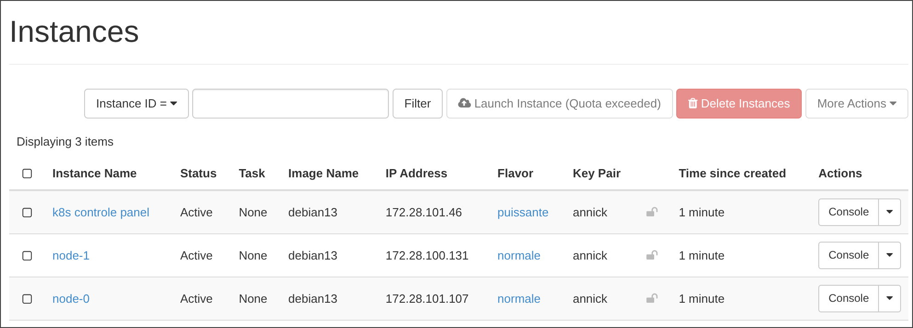

# TP7 -- DAC -- Lucas SAUVAGE

Ceci est le dépôt pour le TP7 DAC de Lucas Sauvage, année 2025-2026 

## Réponses aux questions 

### Q1 

Pour cette question, il est judicieux de reprendre la configuration d'OpenTofu du TP5. 
En effet, pour le TP5 nous devions uniquement créer des VMs, ce qui est la base ici. 
Cependant, il va falloir faire quelques changements car : 

    - Les noms ne sont plus imposés 
    - Une VM doit être plus puissante (donc différente) des deux autres 
    - Elles doivent se connecter au réseau afin de déployer, dans les futures questions, le cluster. 

Une VM doit être plus puissante car K8s nécessite 2 coeurs pour fonctionner pleinement, la flavor `normale` ne suffirait pas.

Pour ce faire on rajoute une variable `network` pour identifier le réseau et des tags pour des actions futures. 
J'avais, au départ, retiré les tags car je pensais que ça ne servait que pour OpenTofu. 
Il se trouve qu'ils sont nécessaires pour créer les groupes de la question suivante. 
Le fichier de configuration final est disponible [**ici**](./tofu/main.tf). 

Les logs de l'éxecution des différentes commandes (i.e. init / plan / apply) sont en bas. 
Voici tout de même une capture d'écran de mon interface OpenStack : 

 

J'avais nommé une machine `k8s control panel`, sauf que visiblement Ansible n'aime pas les espaces (logique). 
J'ai donc renommé la machine en `control-panel`, ce qui est visible dans la deuxième partie du log. 


### Q2 

Au lieu d'utiliser un inventaire contenant des adresses IP statiques, il est possible d'utiliser un inventaire dynamique. 
Cet inventaire va automatiquement récuperer et créer des groupes en fonction des tags définis dans la configuration OpenTofu. 
L'utilisation de cette reconnaissance dynamique permet en premier de gagner du temps, et également d'automatiser encore plus le déploiement. 

J'ai également défini un fichier [**ansible.cfg**](./ansible/ansible.cfg) afin d'indiquer à Ansible où se trouve l'inventaire ainsi que l'utilisateur. 
Le fichier [**clouds.yaml**](./ansible/clouds.yaml) remplace le fichier `terraform.tfvars` et indique à Ansible les variables nécessaires à la connexion OpenStack.
L'inventaire est disponible [**ici**](./ansible/openstack.yaml). 

J'ai eu des problèmes pour récuperer les tags car l'endpoint pour le stockage des données sur OpenStack n'a pas l'air accessible ... 
Ou bien il y a quelque chose qui m'échappe. 
Pour contrecarrer ce problème, j'ai défini les groupes "grâce à du regex" (entre guillemets). 
S'il y a 'node' dans le nom la machine appartient au groupe `nodes` 
S'il y a 'control', elle appartient au groupe `control-panel`. 
Le reste des groupes est à ignorer. 

Les logs de la commande `ansible-inventory --graph --flush-cache`, qui affiche le graphique de l'inventaire est disponible en bas de ce README.
(`--flush-cache` est nécessaire à partir de la seconde exécution de la commande). 

### Q3.1 

Pour installer K8s et Docker ansi que leurs dépendances, il faut : 

    - Installer les logiciels nécessaires : 
        - curl : Permet de "s'abonner" aux dépôts distants 
        - gpg : Permet de vérifier que l'on ne télecharge pas un fichier corrompu (cryptologie) 
        - ca-certificates : Les certificats permettant de vérifier. 
        - apt : Permet d'orchestrer le tout et d'installer les logiciels. 
    - Ajouter les dépôts distants de Docker et K8s 
    - Télécharger les clés GPG 
    - Installer les packets (containerd.io, kubelet, kubeadm,kubectl) 
    - Verrouiller les versions

Le rôle définissant ces tâches Ansible se trouve [**ici**](./ansible/roles/install_docker_k8s/tasks/main.yaml). 
Les logs de l'exécution de ce rôle sont tout en bas. 

Je viens de remarquer que j'avais mis à un "e" à control dans le fichier d'inventaire. 
De plus j'ai orthographié un avec un _ et l'autre avec un -. 
Le `control_panel` correspond au groupe pour l'inventaire. 
Le `control-panel` correspond au nom de la VM. 

### Q3.2 

Pour répondre à cette partie je vais traiter chaque question. 

#### - Les services kubelet et containerd doivent être (auto-)lancés 

Pour ce faire il faut utiliser le module `service` d'Ansible, c'est-à-dire l'outil qui permet d'exécuter les commandes avec `systemctl`. 

#### — Configurez les modules noyau à charger ;

Pour fonctionner, k8s a besoin d'avoir accès à des modules plus avancées de Linux, notamment `overlay` et `br_netfilter`. 
Il faut donc créer un fichier de configuration afin qu'ils se chargent au démarrage et ensuite les lancer (pour le premier démarrage, car le fichier de configuration ne prend effet qu'après un redémarrage). 
`overlay` permet à k8s de "discuter" plus facilement avec les couches hardware et ainsi évite de recopier tout à chaque exécution. 
`br_netfilter` permet au système de surveiller le réseau sur lequel les containers "communiquent". 
Cela permet à k8s de savoir ce qui se passe du côté de Containerd (service minimal de Docker).  

#### — Configurez les paramètres noyau sysctl nécessaires ;

Il faut ensuite laisser les containers se parler entre eux et accéder à internet. 
C'est à ça que sert `sysctl` : Il faut alors mettre les variables suivantes à 1 : 
    
    - net.bridge.bridge-nf-call-iptables
    - net.bridge.bridge-nf-call-ip6tables
    - net.ipv4.ip_forward 

Cela autorise `ip_forward` et `bridge-nf` et par conséquent le bridge des conteneurs. 

#### — Utilisez la commande containerd config default pour pré-générer un fichier de configuration et modifiez en particulier l’entrée SystemdCgroup afin qu’elle soit true ;

Par défaut, Docker utilise Cgroup et k8s utilise `systemd`. 
Il faut donc modifier le dît fichier afin de changer ça afin d'éviter une confusion et que le système plante. 

#### — Donnez les droits à l’utilisateur debian d’utiliser kubectl

Par défaut, seul le super-utilisateur (utilisateur root) peut toucher aux clusters. 
Comme la connection se fait via l'utilisateur debian, il faut changer ça. 
Il faut donc créer un dossier `.kube`, où le fichier de configuration `/etc/kubernetes/admin.conf` sera copié. 
De plus, il faut modifier les droits du fichier afin de laisser l'utilisateur `debian` "l'utiliser". 

Les logs de l'exécution du playbook (qui est en réalité fusionné avec le précédent) se trouve en bas de ce README
Comme on ne fait pas de connection ici, on prépare juste, je ne testerais pas en plus. 
En effet, le playbook s'étant exécuté sans erreurs, on peut être sur que les fichiers ont bien été créés et modifés.
Le rôle réalisant ces tâches est situé [**ici**](./ansible/roles/config_system/tasks/main.yaml). 


### Q3.3 

La commande `kubeadm init` va lancer la base de données du cluster, générer les certificats de sécurité et démarrer les services vitaux. 
Le CIDR, défini à 10.244.0.0/16 permet de générer la plage d'adresses que k8s va utiliser pour chaque Pod.
`flannel` va permettre aux conteuners de "discuter" entre les différentes machines. 

Pour vérifier que le playbook s'est exécuté sans echec et qu'il a bien fait ce qu'il devait faire, il faut exécuter cette commande : `kubectl get nodes`
Le log de l'exécution sur la VM `control-panel` est juste ici : 

```bash
debian@k8s-controle-panel:~$ kubectl get nodes
NAME                 STATUS   ROLES           AGE   VERSION
k8s-controle-panel   Ready    control-plane   12m   v1.30.14
```

Les logs de l'exécution du playbook sont disponibles tout en bas. 
Les tâches exécutées par le playbook sont disponibles [**ici**](./ansible/roles/config_control_panel/tasks/main.yaml). 

### Q3.4 

Pour cette partie, il faut ajouter au cluster les deux VMs représentant les nodes. 
On va pour se faire utiliser le token `join` généré juste avant. 
Ce token va permettre de confirmer que les noeuds sont autorisés à faire partie du cluster via une authentification mutuelle.  

L'exécution de la même commande qu'à la question 3.3 permet de vérifier l'ajout des nodes au cluster : 

```bash
debian@k8s-controle-panel:~$ kubectl get nodes
NAME                 STATUS   ROLES           AGE   VERSION
k8s-controle-panel   Ready    control-plane   26m   v1.30.14
node-0               Ready    <none>          76s   v1.30.14
node-1               Ready    <none>          73s   v1.30.14
```

Les logs de l'exécution du playbook sont disponibles tout en bas de ce README. 
Je n'ai pas recréé de rôle, comme il n'y a qu'une unique tâche. 
Voici cette tâche : 

```bash
- name: Join nodes to cluster
  hosts: nodes
  become: yes
  tasks:
    - name: Join the cluster
      shell: "{{ hostvars['K8S_TOKEN']['token'] }}"
      args:
        creates: /etc/kubernetes/kubelet.conf
```

### Q4

Maintenant que les rôles ont été créés, testés et initialisés, il ne nous reste plus qu'à confirmer que l'architecture fonctionne. 
Pour ce faire, il faut déployer plus de pods que de machines afin de laisser K8s répartir. 
Le fichier définissant les tâches est disponible [**ici**](./verif.yaml). 

J'ai également défini un script qui envoie ce fichier sur la VM, que [**voici**](./execute_verif.sh). 
Ce script sert également à envoyer le second fichier, qui exécute K8s sur la VM afin de confirmer le déploiement des pods. 
Voici les résultats de l'exécution du fichier .sh principal (i.e. *execute_verif*) : 

```bash
Résultats :
---------------------------------------------------
NAME                  READY   STATUS              RESTARTS   AGE   IP       NODE     NOMINATED NODE   READINESS GATES
validation-rs-2br5l   0/1     ContainerCreating   0          15s   <none>   node-0   <none>           <none>
validation-rs-5mgh5   0/1     ContainerCreating   0          15s   <none>   node-1   <none>           <none>
validation-rs-v72fv   0/1     ContainerCreating   0          15s   <none>   node-1   <none>           <none>
validation-rs-z25nq   0/1     ContainerCreating   0          15s   <none>   node-0   <none>           <none>
validation-rs-zl4zp   0/1     ContainerCreating   0          15s   <none>   node-0   <none>           <none>
---------------------------------------------------
```

On peut remarquer que les pods sont en statut "Creating" car je n'ai pas attendu assez longtemps avant de fetch les pods (seulement 15 seconds). 
J'ai, manuellement, fait une seconde vérification qui produit les logs suivants : 

```bash 
[annick@Iusearchbtw tp7]$ ssh control-panel
debian@k8s-controle-panel:~$ kubectl get pods -o wide
NAME                  READY   STATUS    RESTARTS   AGE    IP           NODE     NOMINATED NODE   READINESS GATES
validation-rs-2br5l   1/1     Running   0          2m9s   10.244.1.4   node-0   <none>           <none>
validation-rs-5mgh5   1/1     Running   0          2m9s   10.244.2.2   node-1   <none>           <none>
validation-rs-v72fv   1/1     Running   0          2m9s   10.244.2.3   node-1   <none>           <none>
validation-rs-z25nq   1/1     Running   0          2m9s   10.244.1.2   node-0   <none>           <none>
validation-rs-zl4zp   1/1     Running   0          2m9s   10.244.1.3   node-0   <none>           <none>
debian@k8s-controle-panel:~$ 
```

Les pods sont maintenant en statut "Running", ce qui prouve que l'architecture fonctionne. 
De plus, on voit que les pods sont bien répartis : Il y en a 3 sur node-0 et 2 sur node-1. 
L'architecture fonctionne donc comme convenu, et cela conclue ce TP.

## Logs 

### Q1

<details>Cliquez pour voir les logs de la Q1 (uniquement `tofu appy`)<summary>

```bash
[annick@Iusearchbtw tofu]$ tofu apply
var.os_password
  Enter a value: 
data.openstack_networking_network_v2.network: Reading...
data.openstack_images_image_v2.debian: Reading...
data.openstack_images_image_v2.debian: Read complete after 0s [id=5be306c3-1beb-44c2-ac78-d3f1a7cbc491]
data.openstack_networking_network_v2.network: Read complete after 0s [id=93f95551-7bc6-49fd-b9a1-0be4b191dcc4]
OpenTofu used the selected providers to generate the following execution plan. Resource actions are indicated with the following symbols:
  + create

OpenTofu will perform the following actions:

  # openstack_compute_instance_v2.control_panel will be created
  + resource "openstack_compute_instance_v2" "control_panel" {
      + access_ip_v4        = (known after apply)
      + access_ip_v6        = (known after apply)
      + all_metadata        = (known after apply)
      + all_tags            = (known after apply)
      + availability_zone   = (known after apply)
      + created             = (known after apply)
      + flavor_id           = (known after apply)
      + flavor_name         = "puissante"
      + force_delete        = false
      + id                  = (known after apply)
      + image_id            = "5be306c3-1beb-44c2-ac78-d3f1a7cbc491"
      + image_name          = (known after apply)
      + key_pair            = "annick"
      + name                = "k8s controle panel"
      + power_state         = "active"
      + region              = (known after apply)
      + security_groups     = [
          + "default",
        ]
      + stop_before_destroy = false
      + tags                = [
          + "cluster",
          + "vm_control_panel",
        ]
      + updated             = (known after apply)

      + network {
          + access_network = false
          + fixed_ip_v4    = (known after apply)
          + fixed_ip_v6    = (known after apply)
          + floating_ip    = (known after apply)
          + mac            = (known after apply)
          + name           = (known after apply)
          + port           = (known after apply)
          + uuid           = "93f95551-7bc6-49fd-b9a1-0be4b191dcc4"
        }
    }

  # openstack_compute_instance_v2.nodes[0] will be created
  + resource "openstack_compute_instance_v2" "nodes" {
      + access_ip_v4        = (known after apply)
      + access_ip_v6        = (known after apply)
      + all_metadata        = (known after apply)
      + all_tags            = (known after apply)
      + availability_zone   = (known after apply)
      + created             = (known after apply)
      + flavor_id           = (known after apply)
      + flavor_name         = "normale"
      + force_delete        = false
      + id                  = (known after apply)
      + image_id            = "5be306c3-1beb-44c2-ac78-d3f1a7cbc491"
      + image_name          = (known after apply)
      + key_pair            = "annick"
      + name                = "node-0"
      + power_state         = "active"
      + region              = (known after apply)
      + security_groups     = [
          + "default",
        ]
      + stop_before_destroy = false
      + tags                = [
          + "cluster",
          + "vm_nodes",
        ]
      + updated             = (known after apply)

      + network {
          + access_network = false
          + fixed_ip_v4    = (known after apply)
          + fixed_ip_v6    = (known after apply)
          + floating_ip    = (known after apply)
          + mac            = (known after apply)
          + name           = (known after apply)
          + port           = (known after apply)
          + uuid           = "93f95551-7bc6-49fd-b9a1-0be4b191dcc4"
        }
    }

  # openstack_compute_instance_v2.nodes[1] will be created
  + resource "openstack_compute_instance_v2" "nodes" {
      + access_ip_v4        = (known after apply)
      + access_ip_v6        = (known after apply)
      + all_metadata        = (known after apply)
      + all_tags            = (known after apply)
      + availability_zone   = (known after apply)
      + created             = (known after apply)
      + flavor_id           = (known after apply)
      + flavor_name         = "normale"
      + force_delete        = false
      + id                  = (known after apply)
      + image_id            = "5be306c3-1beb-44c2-ac78-d3f1a7cbc491"
      + image_name          = (known after apply)
      + key_pair            = "annick"
      + name                = "node-1"
      + power_state         = "active"
      + region              = (known after apply)
      + security_groups     = [
          + "default",
        ]
      + stop_before_destroy = false
      + tags                = [
          + "cluster",
          + "vm_nodes",
        ]
      + updated             = (known after apply)

      + network {
          + access_network = false
          + fixed_ip_v4    = (known after apply)
          + fixed_ip_v6    = (known after apply)
          + floating_ip    = (known after apply)
          + mac            = (known after apply)
          + name           = (known after apply)
          + port           = (known after apply)
          + uuid           = "93f95551-7bc6-49fd-b9a1-0be4b191dcc4"
        }
    }

Plan: 3 to add, 0 to change, 0 to destroy.

Do you want to perform these actions?
  OpenTofu will perform the actions described above.
  Only 'yes' will be accepted to approve.

  Enter a value: yes

openstack_compute_instance_v2.nodes[0]: Creating...
openstack_compute_instance_v2.nodes[1]: Creating...
openstack_compute_instance_v2.control_panel: Creating...
openstack_compute_instance_v2.nodes[0]: Still creating... [10s elapsed]
openstack_compute_instance_v2.nodes[1]: Still creating... [10s elapsed]
openstack_compute_instance_v2.control_panel: Still creating... [10s elapsed]
openstack_compute_instance_v2.nodes[0]: Still creating... [20s elapsed]
openstack_compute_instance_v2.nodes[1]: Still creating... [20s elapsed]
openstack_compute_instance_v2.control_panel: Still creating... [20s elapsed]
openstack_compute_instance_v2.nodes[0]: Creation complete after 21s [id=e5ab22e7-8c0c-4077-8d79-9daffd9145d1]
openstack_compute_instance_v2.nodes[1]: Still creating... [30s elapsed]
openstack_compute_instance_v2.control_panel: Still creating... [30s elapsed]
openstack_compute_instance_v2.control_panel: Creation complete after 32s [id=02dceb7c-71f3-4394-ba19-ce46835a774e]
openstack_compute_instance_v2.nodes[1]: Creation complete after 32s [id=5a278bae-28b1-475a-8697-6b1c02c9d740]

Apply complete! Resources: 3 added, 0 changed, 0 destroyed.
```

Modification du nom de la VM de contrôle : 

```bash
[annick@Iusearchbtw tofu]$ tofu apply
var.os_password
  Enter a value: 

data.openstack_networking_network_v2.network: Reading...
data.openstack_images_image_v2.debian: Reading...
data.openstack_images_image_v2.debian: Read complete after 5s [id=5be306c3-1beb-44c2-ac78-d3f1a7cbc491]
data.openstack_networking_network_v2.network: Read complete after 5s [id=93f95551-7bc6-49fd-b9a1-0be4b191dcc4]
openstack_compute_instance_v2.control_panel: Refreshing state... [id=02dceb7c-71f3-4394-ba19-ce46835a774e]
openstack_compute_instance_v2.nodes[0]: Refreshing state... [id=e5ab22e7-8c0c-4077-8d79-9daffd9145d1]
openstack_compute_instance_v2.nodes[1]: Refreshing state... [id=5a278bae-28b1-475a-8697-6b1c02c9d740]

OpenTofu used the selected providers to generate the following execution plan. Resource actions are indicated with the following symbols:
  ~ update in-place

OpenTofu will perform the following actions:

  # openstack_compute_instance_v2.control_panel will be updated in-place
  ~ resource "openstack_compute_instance_v2" "control_panel" {
        id                  = "02dceb7c-71f3-4394-ba19-ce46835a774e"
      ~ name                = "k8s controle panel" -> "controle-panel"
        tags                = [
            "cluster",
            "vm_control_panel",
        ]
        # (16 unchanged attributes hidden)

        # (1 unchanged block hidden)
    }

Plan: 0 to add, 1 to change, 0 to destroy.

Do you want to perform these actions?
  OpenTofu will perform the actions described above.
  Only 'yes' will be accepted to approve.

  Enter a value: yes

openstack_compute_instance_v2.control_panel: Modifying... [id=02dceb7c-71f3-4394-ba19-ce46835a774e]
openstack_compute_instance_v2.control_panel: Modifications complete after 1s [id=02dceb7c-71f3-4394-ba19-ce46835a774e]

Apply complete! Resources: 0 added, 1 changed, 0 destroyed.
```

</summary></details>

### Q2

<details>Cliquez pour voir les logs de la Q2<summary>

```bash
[annick@Iusearchbtw ansible]$ ansible-inventory --graph --flush-cache -vvv
@all:
  |--@ungrouped:
  |--@control_panel:
  |  |--controle-panel
  |--@nodes:
  |  |--node-1
  |  |--node-0
  |--@openstack:
  |  |--controle-panel
  |  |--node-1
  |  |--node-0
  |--@RegionOne:
  |  |--controle-panel
  |  |--node-1
  |  |--node-0
  |--@openstack_RegionOne:
  |  |--controle-panel
  |  |--node-1
  |  |--node-0
  |--@instance-02dceb7c-71f3-4394-ba19-ce46835a774e:
  |  |--controle-panel
  |--@flavor-puissante:
  |  |--controle-panel
  |--@image-None:
  |  |--controle-panel
  |  |--node-1
  |  |--node-0
  |--@nova:
  |  |--controle-panel
  |  |--node-1
  |  |--node-0
  |--@RegionOne_nova:
  |  |--controle-panel
  |  |--node-1
  |  |--node-0
  |--@openstack_RegionOne_nova:
  |  |--controle-panel
  |  |--node-1
  |  |--node-0
  |--@instance-5a278bae-28b1-475a-8697-6b1c02c9d740:
  |  |--node-1
  |--@flavor-normale:
  |  |--node-1
  |  |--node-0
  |--@instance-e5ab22e7-8c0c-4077-8d79-9daffd9145d1:
  |  |--node-0
```

</summary></details>


### Q3.1 

<details>Cliquez pour voir les logs de la Q3.1<summary>

```bash
[annick@Iusearchbtw ansible]$ ansible-playbook playbook/docker_k8s.yaml 
[WARNING]: Invalid characters were found in group names but not replaced, use -vvvv to see details

PLAY [Install Docker & K8s] ******************************************************************************************************************************

TASK [Gathering Facts] ***********************************************************************************************************************************
[WARNING]: Host 'node-0' is using the discovered Python interpreter at '/usr/bin/python3.13', but future installation of another Python interpreter could cause a different interpreter to be discovered. See https://docs.ansible.com/ansible-core/2.20/reference_appendices/interpreter_discovery.html for more information.
ok: [node-0]
[WARNING]: Host 'node-1' is using the discovered Python interpreter at '/usr/bin/python3.13', but future installation of another Python interpreter could cause a different interpreter to be discovered. See https://docs.ansible.com/ansible-core/2.20/reference_appendices/interpreter_discovery.html for more information.
ok: [node-1]
[WARNING]: Host 'controle-panel' is using the discovered Python interpreter at '/usr/bin/python3.13', but future installation of another Python interpreter could cause a different interpreter to be discovered. See https://docs.ansible.com/ansible-core/2.20/reference_appendices/interpreter_discovery.html for more information.
ok: [controle-panel]

TASK [install_docker_k8s : Install prerequisites] ********************************************************************************************************
ok: [node-0]
ok: [node-1]
changed: [controle-panel]

TASK [install_docker_k8s : Add Docker GPG key] ***********************************************************************************************************
ok: [node-1]
ok: [node-0]
changed: [controle-panel]

TASK [install_docker_k8s : Add Docker repo] **************************************************************************************************************
ok: [node-1]
ok: [node-0]
changed: [controle-panel]

TASK [install_docker_k8s : Add K8s GPG key] **************************************************************************************************************
ok: [node-1]
changed: [controle-panel]
ok: [node-0]

TASK [install_docker_k8s : Add K8s repo] *****************************************************************************************************************
ok: [node-1]
ok: [node-0]
changed: [controle-panel]

TASK [install_docker_k8s : Installing packages] **********************************************************************************************************
ok: [node-1]
ok: [node-0]
changed: [controle-panel]

TASK [install_docker_k8s : Block versions] ***************************************************************************************************************
changed: [controle-panel] => (item=containerd.io)
ok: [node-1] => (item=containerd.io)
ok: [node-0] => (item=containerd.io)
changed: [controle-panel] => (item=kubelet)
ok: [node-1] => (item=kubelet)
ok: [node-0] => (item=kubelet)
ok: [node-1] => (item=kubeadm)
changed: [controle-panel] => (item=kubeadm)
ok: [node-0] => (item=kubeadm)
changed: [controle-panel] => (item=kubectl)
ok: [node-1] => (item=kubectl)
ok: [node-0] => (item=kubectl)

PLAY RECAP ***********************************************************************************************************************************************
controle-panel             : ok=8    changed=7    unreachable=0    failed=0    skipped=0    rescued=0    ignored=0   
node-0                     : ok=8    changed=0    unreachable=0    failed=0    skipped=0    rescued=0    ignored=0   
node-1                     : ok=8    changed=0    unreachable=0    failed=0    skipped=0    rescued=0    ignored=0  
```


</summary></details>


### Q3.2 

<details>Cliquez pour voir les logs de la Q3.2<summary>

```bash
PLAY [Setup system] **************************************************************************************************************************************

TASK [Gathering Facts] ***********************************************************************************************************************************
ok: [node-1]
ok: [controle-panel]
ok: [node-0]

TASK [config_system : Create config file for modules] ****************************************************************************************************
changed: [controle-panel]
changed: [node-1]
changed: [node-0]

TASK [config_system : Load modules] **********************************************************************************************************************
ok: [controle-panel] => (item=overlay)
ok: [node-0] => (item=overlay)
ok: [node-1] => (item=overlay)
changed: [node-1] => (item=br_netfilter)
changed: [controle-panel] => (item=br_netfilter)
changed: [node-0] => (item=br_netfilter)

TASK [config_system : Change sysctl parameters] **********************************************************************************************************
[WARNING]: Deprecation warnings can be disabled by setting `deprecation_warnings=False` in ansible.cfg.
[DEPRECATION WARNING]: Importing 'to_native' from 'ansible.module_utils._text' is deprecated. This feature will be removed from ansible-core version 2.24. Use ansible.module_utils.common.text.converters instead.
changed: [node-0] => (item={'name': 'net.bridge.bridge-nf-call-iptables', 'value': '1'})
changed: [node-1] => (item={'name': 'net.bridge.bridge-nf-call-iptables', 'value': '1'})
changed: [controle-panel] => (item={'name': 'net.bridge.bridge-nf-call-iptables', 'value': '1'})
changed: [node-0] => (item={'name': 'net.bridge.bridge-nf-call-ip6tables', 'value': '1'})
changed: [controle-panel] => (item={'name': 'net.bridge.bridge-nf-call-ip6tables', 'value': '1'})
changed: [node-1] => (item={'name': 'net.bridge.bridge-nf-call-ip6tables', 'value': '1'})
changed: [controle-panel] => (item={'name': 'net.ipv4.ip_forward', 'value': '1'})
changed: [node-0] => (item={'name': 'net.ipv4.ip_forward', 'value': '1'})
changed: [node-1] => (item={'name': 'net.ipv4.ip_forward', 'value': '1'})

TASK [config_system : Create directory for containerd config] ********************************************************************************************
ok: [node-1]
ok: [controle-panel]
ok: [node-0]

TASK [config_system : Generate default config for containerd] ********************************************************************************************
changed: [controle-panel]
changed: [node-0]
changed: [node-1]

TASK [config_system : Set SystemdCgroup to true] *********************************************************************************************************
changed: [controle-panel]
changed: [node-0]
changed: [node-1]

TASK [config_system : Activate and start services] *******************************************************************************************************
ok: [node-0] => (item=containerd)
ok: [node-1] => (item=containerd)
ok: [controle-panel] => (item=containerd)
changed: [node-0] => (item=kubelet)
changed: [controle-panel] => (item=kubelet)
changed: [node-1] => (item=kubelet)

TASK [config_system : Create directory .kube for debian usr] *********************************************************************************************
changed: [controle-panel]
changed: [node-0]
changed: [node-1]

RUNNING HANDLER [config_system : Restart containerd] *****************************************************************************************************
changed: [controle-panel]
changed: [node-0]
changed: [node-1]

PLAY RECAP ***********************************************************************************************************************************************
controle-panel             : ok=18   changed=8    unreachable=0    failed=0    skipped=0    rescued=0    ignored=0   
node-0                     : ok=18   changed=8    unreachable=0    failed=0    skipped=0    rescued=0    ignored=0   
node-1                     : ok=18   changed=8    unreachable=0    failed=0    skipped=0    rescued=0    ignored=0   
```

</summary></details>

### Q3.3

<details>Cliquez pour voir les logs de la Q3.3<summary> 

NB : Le playbook s'appelle `test` car je n'ai pas envie de refaire les tâches précédentes à chaque fois pendant le test. 

```bash
[annick@Iusearchbtw ansible]$ ansible-playbook playbook/test.yaml 
[WARNING]: Invalid characters were found in group names but not replaced, use -vvvv to see details

PLAY [Debug control init] ********************************************************************************************************************************

TASK [Gathering Facts] ***********************************************************************************************************************************
[WARNING]: Host 'controle-panel' is using the discovered Python interpreter at '/usr/bin/python3.13', but future installation of another Python interpreter could cause a different interpreter to be discovered. See https://docs.ansible.com/ansible-core/2.20/reference_appendices/interpreter_discovery.html for more information.
ok: [controle-panel]

TASK [config_control_panel : Init kubeadm] ***************************************************************************************************************
changed: [controle-panel]

TASK [config_control_panel : Setup config pour debian] ***************************************************************************************************
changed: [controle-panel]

TASK [config_control_panel : Install Flannel] ************************************************************************************************************
changed: [controle-panel]

TASK [config_control_panel : Get join token] *************************************************************************************************************
changed: [controle-panel]

TASK [config_control_panel : Save token] *****************************************************************************************************************
changed: [controle-panel]

PLAY RECAP ***********************************************************************************************************************************************
controle-panel             : ok=6    changed=5    unreachable=0    failed=0    skipped=0    rescued=0    ignored=0   

</summary></details>
```

### Q3.4 

<details>Cliquez pour voir les logs de la Q3.4<summary>

</summary></details>

### Q4

<details>Cliquez pour voir les logs de la Q4<summary>

```bash
[annick@Iusearchbtw tp7]$ ./execute_verif.sh 
> [1/2] Sending verif file to VM with IP : 172.28.101.46 ...
Warning: Permanently added '172.28.101.46' (ED25519) to the list of known hosts.
scp: dest open "/home/verif.yaml": Permission denied
scp: failed to upload file verif.yaml to /home/
scp: dest open "/home/execute_verif_on_vm.sh": Permission denied
scp: failed to upload file execute_verif_on_vm.sh to /home/
Copy error.
[annick@Iusearchbtw tp7]$ ./execute_verif.sh 
> [1/2] Sending verif file to VM with IP : 172.28.101.46 ...
Warning: Permanently added '172.28.101.46' (ED25519) to the list of known hosts.
verif.yaml                                                                                                              100%  308    24.4KB/s   00:00    
execute_verif_on_vm.sh                                                                                                  100%  423    41.0KB/s   00:00    
> [2/2] Executing verif script ...
Warning: Permanently added '172.28.101.46' (ED25519) to the list of known hosts.
> [1/3] Apply verif using K8s..
replicaset.apps/validation-rs created
> [2/3] Waiting pods to start...

Résultats :
---------------------------------------------------
NAME                  READY   STATUS              RESTARTS   AGE   IP       NODE     NOMINATED NODE   READINESS GATES
validation-rs-2br5l   0/1     ContainerCreating   0          15s   <none>   node-0   <none>           <none>
validation-rs-5mgh5   0/1     ContainerCreating   0          15s   <none>   node-1   <none>           <none>
validation-rs-v72fv   0/1     ContainerCreating   0          15s   <none>   node-1   <none>           <none>
validation-rs-z25nq   0/1     ContainerCreating   0          15s   <none>   node-0   <none>           <none>
validation-rs-zl4zp   0/1     ContainerCreating   0          15s   <none>   node-0   <none>           <none>
---------------------------------------------------
[annick@Iusearchbtw tp7]$ ssh control-panel
debian@k8s-controle-panel:~$ kubectl get pods -o wide
NAME                  READY   STATUS    RESTARTS   AGE    IP           NODE     NOMINATED NODE   READINESS GATES
validation-rs-2br5l   1/1     Running   0          2m9s   10.244.1.4   node-0   <none>           <none>
validation-rs-5mgh5   1/1     Running   0          2m9s   10.244.2.2   node-1   <none>           <none>
validation-rs-v72fv   1/1     Running   0          2m9s   10.244.2.3   node-1   <none>           <none>
validation-rs-z25nq   1/1     Running   0          2m9s   10.244.1.2   node-0   <none>           <none>
validation-rs-zl4zp   1/1     Running   0          2m9s   10.244.1.3   node-0   <none>           <none>
debian@k8s-controle-panel:~$ 
```


</summary></details>

